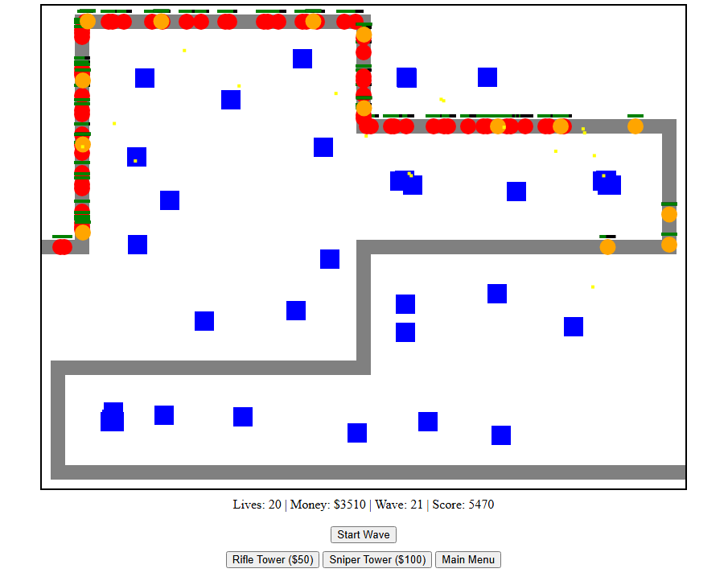

# 28 Years After

A single-page **tower defense game** built with **HTML and JavaScript**. Defend your base by placing towers and stopping waves of enemies across multiple maps.

---

## Features

* Classic tower defense gameplay
* Place towers to defend against enemy waves
* Two tower types:

  * **Rifle Tower**
  * **Sniper Tower**
* Three maps with unique paths:

  * **River Path** – meandering left-to-right path
  * **Full Map** – path covering the entire map area
  * **Heartbeat** – ECG-style path with sharp peaks and valleys
* Start menu with map selection
* Night mode toggle for dark theme
* Real-time game loop with canvas rendering
* Earn money by defeating enemies to buy more towers
* Start new waves at any time, including overlapping waves
* All gameplay visuals are rendered via the HTML5 <canvas> making JavaScript the single source of truth
* Minimising CSS reduces complexity and keeps the focus on game logic, performance, and mechanics

---

## Screenshots

### Main Menu

### Full Map Gameplay

### Heartbeat Map (Rage Mode)

## How to Play

1. Select a map from the start menu.
2. Click **Start Game** to begin.
3. Select a tower type and click on the map to place it
4. Click **Start Wave** to spawn enemies.
5. Defend your base and prevent enemies from reaching the end.
6. Earn money by defeating enemies and use it to purchase more towers.

---

## Controls

* Click map buttons to select a map before starting
* Click **Rifle Tower** or **Sniper Tower** to select a tower type
* Click on the canvas to place a tower
* Use the **Night Mode** toggle (top-right) to switch themes
* Click **Start Wave** to spawn a new wave at any time

---

## Running the Game

Open `index.html` in a modern web browser.

---

## Development Notes

### Enemy Class

* Moves along the selected path using linear interpolation
* Speed and health scale with wave number
* Every 5th enemy in a wave:

  * Moves faster
  * Changes color
* Reduces player lives if it reaches the end

### Tower Class

* **Rifle Tower**

  * Medium range
  * Fast attack speed
  * Lower damage
  
* **Sniper Tower**

  * Long range
  * Slower attack speed
  * Higher damage
* Automatically targets the first enemy within range
* Spawns projectiles toward the target

### Projectile Class

* Moves toward its target enemy at a fixed speed
* Damages the enemy upon impact
* Destroys itself after hitting
* Rewards the player with money and score if the enemy is killed

### Wave System

* Waves spawn enemies over time using `setInterval`
* Multiple waves can be started without waiting for previous waves to finish

### Game Loop

* Runs using `requestAnimationFrame` for smooth rendering
* Updates enemies, towers, projectiles, and UI each frame

### UI Updates

* Tracks lives, money, score, wave, and high score in real time
* High score automatically updates if the current score exceeds it

---

## AI Assistance

This project was developed with assistance from AI tools (Open Ai's ChatGPT and the Google Chrome Web Tools), which were used to:

* Review and debug JavaScript code, including issues with enemy spawning and wave handling
* Generate structured documentation and README content
* Provide explanations and guidance for implementing overlapping waves, enemy scaling, and UI updates

AI was used as a **collaborative development assistant** to streamline development, clarify logic, and enhance readability. All final code and design decisions were made and implemented by the developer.

